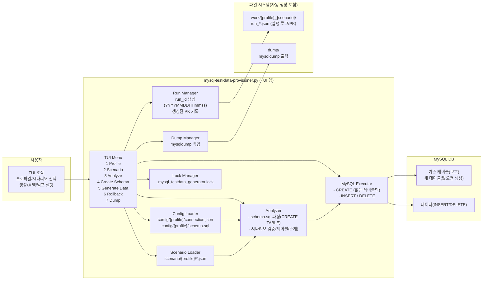
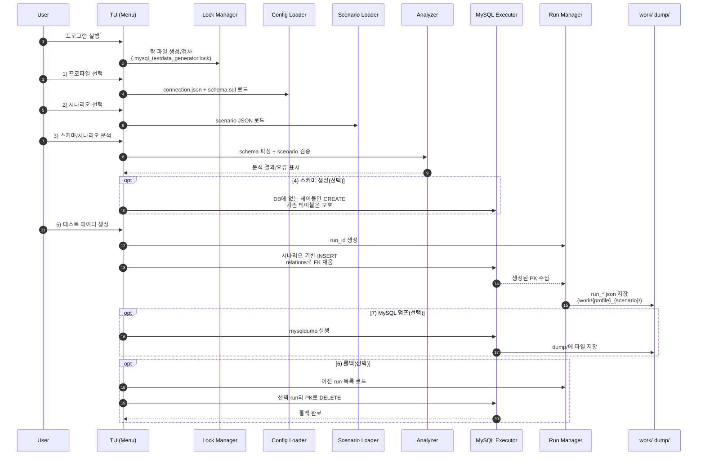
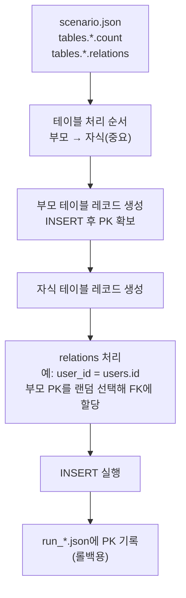
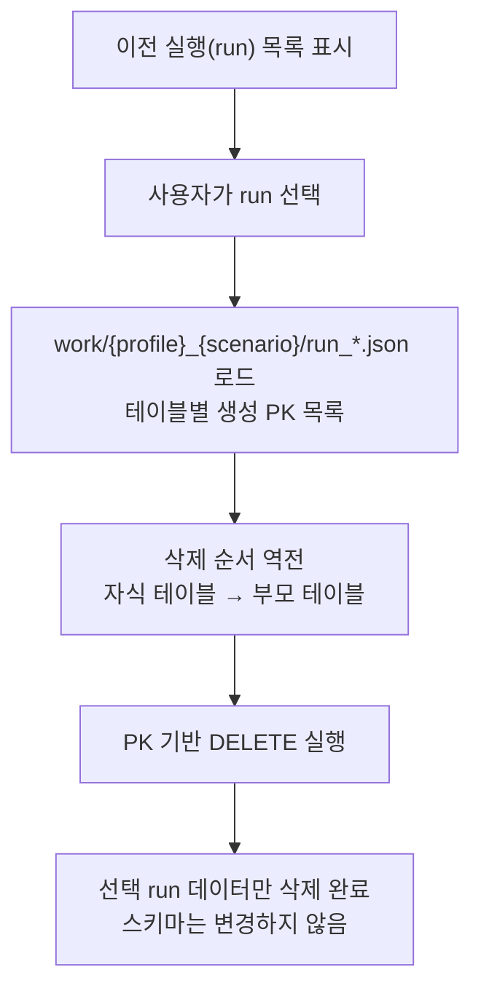
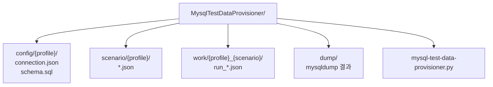

# MySQL 테스트 데이터 생성기 (TUI)

MySQL 데이터베이스를 위한 자동 테스트 데이터 생성 및 관리 도구입니다.

## 주요 기능

1. **MySQL 스키마 파일 읽기** - CREATE TABLE 문 자동 파싱
2. **스키마 자동 생성** - DB에 없는 테이블 자동 생성 (기존 테이블은 보호)
3. **시나리오 기반 데이터 생성** - 연관관계 매핑 및 테스트 레코드 자동 생성
4. **자동 FK 관계 감지** - 컬럼명 기반 자동 외래키 관계 매핑 (relations 생략 가능)
5. **데이터 롤백** - 생성된 데이터를 run 단위로 삭제
6. **MySQL 덤프** - mysqldump를 통한 백업
7. **스키마 보호** - 기존 테이블 수정 없이 레코드만 조작
8. **중복 실행 방지** - 락 파일 기반
9. **TUI 인터페이스** - 직관적인 터미널 UI

## 전체 아키텍처(컴포넌트) 다이어그램


## TUI 사용 흐름(시퀀스 다이어그램)


## 데이터 생성과 관계(relations) 처리 흐름


## 롤백 시스템( run 단위 삭제, FK 위반 방지 )


## 디렉터리 구조(산출물 중심)


## 설치

```bash
# 의존성 설치
pip install -r requirements.txt

# Windows의 경우 curses 추가 설치
pip install windows-curses
```

## 디렉토리 구조

```
MysqlTestDataProvisioner/
├── config/                    # 설정 파일
│   └── {profile}/
│       ├── connection.json   # DB 연결 정보
│       └── schema.sql        # 테이블 스키마
├── scenario/                 # 시나리오 파일
│   └── {profile}/
│       └── *.json           # 테스트 시나리오
├── work/                     # 실행 로그 (자동 생성)
│   └── {profile}_{scenario}/
│       └── run_*.json       # 각 실행 로그
├── dump/                     # MySQL 덤프 파일 (자동 생성)
└── mysql-test-data-provisioner.py
```

## 설정 파일 형식

### connection.json

```json
{
  "host": "127.0.0.1",
  "port": 3306,
  "user": "root",
  "password": "password",
  "database": "test_db"
}
```

### schema.sql

```sql
CREATE TABLE `users` (
  `id` INT AUTO_INCREMENT PRIMARY KEY,
  `username` VARCHAR(50) NOT NULL,
  `email` VARCHAR(100) NOT NULL,
  `created_at` DATETIME DEFAULT CURRENT_TIMESTAMP
);

CREATE TABLE `orders` (
  `id` INT AUTO_INCREMENT PRIMARY KEY,
  `user_id` INT NOT NULL,
  `order_number` VARCHAR(50) NOT NULL,
  `total_amount` INT NOT NULL,
  `status` VARCHAR(20) DEFAULT 'pending',
  `created_at` DATETIME DEFAULT CURRENT_TIMESTAMP
);
```

### 시나리오 파일 (scenario/*.json)

시나리오 파일은 각 테이블에 생성할 레코드 수만 정의합니다. FK 관계는 스키마에서 자동으로 감지됩니다.

```json
{
  "name": "Basic Test Scenario",
  "description": "사용자와 주문 테스트 데이터",
  "tables": {
    "users": {
      "count": 10
    },
    "orders": {
      "count": 30
    }
  }
}
```

#### 자동 FK 관계 감지

**모든 FK 관계는 스키마를 기반으로 자동으로 감지됩니다.**

**자동 감지 규칙:**
- `{table_name}_id` 형식의 컬럼은 자동으로 `{table_name}.id`를 참조
- 예: `user_id` → `users.id` (단수형→복수형 자동 변환)
- 예: `customer_id` → `customers.id` (단수형→복수형 자동 변환)
- 예: `category_id` → `categories.id` (y→ies 변환 지원)
- 예: `product_id` → `products.id` (s 추가)

**동작 방식:**
- 스키마 분석 시 `_id`로 끝나는 컬럼을 자동으로 FK로 인식
- 부모 테이블에서 랜덤하게 PK를 선택하여 FK에 할당
- 시나리오 파일에 `relations` 필드를 작성할 필요 없음

## 사용 방법

### 1. 프로그램 실행

```bash
python mysql-test-data-provisioner.py
```

### 2. TUI 메뉴

```
1: 프로파일 선택       - config/ 디렉토리에서 프로파일 선택
2: 시나리오 선택       - scenario/ 디렉토리에서 시나리오 선택
3: 스키마/시나리오 분석 - 선택한 파일들을 파싱 및 분석
4: 스키마 생성 (테이블) - DB에 없는 테이블 자동 생성
5: 테스트 데이터 생성   - 실제 DB에 데이터 INSERT
6: 데이터 롤백        - 이전에 생성한 데이터 삭제
7: MySQL 덤프         - DB 전체 백업
Q: 종료
```

### 3. 작업 순서

1. **프로파일 선택** (메뉴 1)
   - config/ 디렉토리의 프로파일 중 선택
   - DB 연결 정보 자동 로드

2. **시나리오 선택** (메뉴 2)
   - 선택한 프로파일의 시나리오 파일 중 선택

3. **스키마/시나리오 분석** (메뉴 3)
   - 스키마 파일 파싱
   - 시나리오 파일 로드 및 검증

4. **스키마 생성** (메뉴 4) - 선택사항
   - DB에 테이블이 없을 경우 자동 생성
   - 기존 테이블은 건드리지 않음
   - 없는 테이블만 생성

5. **테스트 데이터 생성** (메뉴 5)
   - 시나리오에 정의된 만큼 데이터 생성
   - 연관관계 자동 처리
   - 진행률 실시간 표시
   - 생성 정보는 work/ 디렉토리에 저장

6. **데이터 롤백** (메뉴 6)
   - 이전 실행(run) 목록 표시
   - 선택한 run의 데이터만 삭제
   - 스키마는 변경하지 않음

## 롤백 시스템

- 각 실행마다 고유한 `run_id` 생성 (YYYYMMDDHHmmss)
- 생성된 레코드의 PK를 JSON 파일로 저장 (`work/{profile}_{scenario}/run_*.json`)
- 프로파일과 시나리오별로 별도 디렉토리에서 관리
- 롤백 시 해당 PK를 기반으로 DELETE 수행
- 자식 테이블부터 역순으로 삭제하여 FK 제약 위반 방지

## 스키마 보호

- 스키마 파일은 읽기 전용으로 사용
- DDL 명령 실행 안 함
- INSERT, DELETE만 수행
- 기존 테이블 구조 절대 변경하지 않음

## 주의사항

1. **프로덕션 환경 주의**
   - 테스트/개발 환경에서만 사용 권장
   - 프로덕션 DB에 직접 연결 금지

2. **FK 제약 조건**
   - 시나리오 파일에서 테이블 순서 중요
   - 부모 테이블을 자식 테이블보다 먼저 정의
   - 자동 FK 감지 사용 시: `{table}_id` 형식의 컬럼명 권장

3. **PK 요구사항**
   - 모든 테이블에 AUTO_INCREMENT PK 필요
   - PK 없는 테이블은 롤백 불가

4. **중복 실행**
   - 락 파일(.mysql_testdata_generator.lock)로 방지
   - 비정상 종료 시 락 파일 수동 삭제 필요

## 예제

### 간단한 예제

1. config/example/ 디렉토리에 connection.json, schema.sql 생성
2. scenario/example/ 디렉토리에 small-test.json 생성
3. 프로그램 실행: `python mysql-test-data-provisioner.py`
4. 메뉴 1에서 "example" 프로파일 선택
5. 메뉴 2에서 "small-test.json" 시나리오 선택
6. 메뉴 3에서 분석 실행
7. 메뉴 4에서 스키마 생성 (테이블 생성)
8. 메뉴 5에서 데이터 생성
   - 생성된 데이터 정보는 `work/example_small-test/` 디렉토리에 저장됨
9. 필요 시 메뉴 6에서 롤백

## 트러블슈팅

### 프로파일이 표시되지 않음
- config/{profile}/connection.json과 schema.sql이 모두 있는지 확인

### DB 연결 실패
- connection.json의 호스트, 포트, 계정 정보 확인
- MySQL 서버 실행 상태 확인

### 데이터 생성 실패
- 스키마와 시나리오 파일 형식 확인
- FK 제약 조건 확인
- 테이블 순서 확인 (부모 → 자식)

### 락 파일 오류
- 다른 인스턴스 종료 또는 .mysql_testdata_generator.lock 파일 삭제

## 라이선스

Apache 2.0 License

